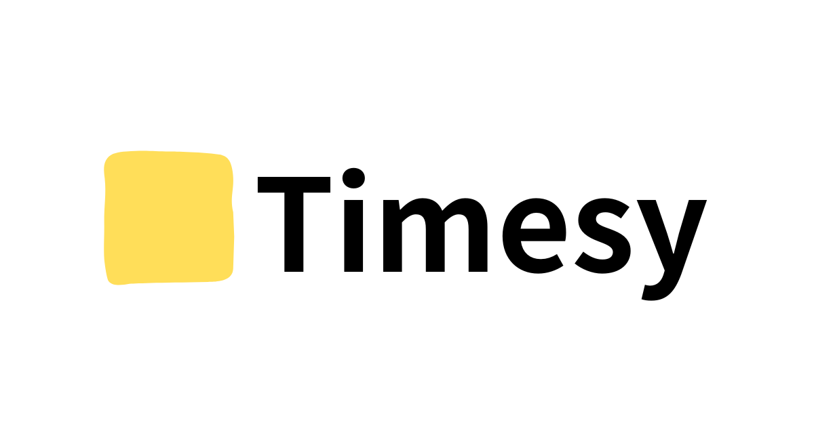

**Timesy**は開発者のためのソーシャル分報アプリです。

## Requirement

- Docker
- Docker Compose

## Development

```sh
gh repo clone moekidev/timesy
```

```sh
cd timesy
```

```sh
docker compose run --rm web bin/setup
```

```sh
docker compose up
```

## Star History

[](https://star-history.com/#moekidev/timesy&Date)

## Contribution

バグ報告やプルリクエストは、GitHubの https://github.com/moekidev/timesy にお願いします。このプロジェクトは、コラボレーションのための安全で歓迎的な空間を目指しており、貢献者は[行動規範](https://github.com/moekidev/timesy/blob/main/CODE_OF_CONDUCT.md)を守ることが期待されています。

## License

このアプリは、[MITライセンス](https://opensource.org/licenses/MIT)の条件の下でオープンソースとして利用可能です。

## Code of Conduct

Timesy プロジェクトのコードベース、問題追跡システム、チャットルーム、メーリングリストで交流する全ての人々は、[行動規範](https://github.com/moekidev/timesy/blob/main/CODE_OF_CONDUCT.md)に従うことが期待されています。
