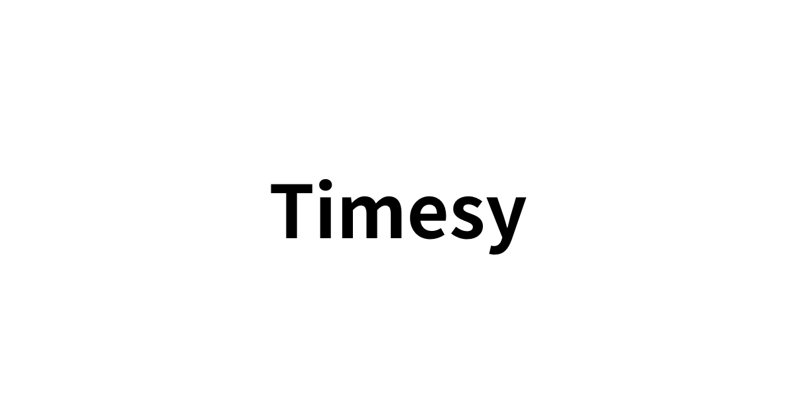

**timesy.dev** is a social technical note application for developers⏳

## Requirement

- Docker
- Docker Compose

## Development

```sh
gh repo clone moekidev/timesy
```

```sh
cd timesy
```

```sh
docker compose run --rm web bin/setup
```

```sh
docker compose up
```

## Star History

[](https://star-history.com/#moekidev/timesy&) Date)

## Contribution

Bug reports and pull requests should be sent to https://github.com/moekidev/timesy on GitHub. This project aims to be a safe and welcoming space for collaboration, and contributors are expected to abide by the [Code of Conduct](https://github.com/moekidev/timesy/blob/main/CODE_OF_CONDUCT.md).

## License

This application is available as open source under the terms of the [MIT License](https://opensource.org/licenses/MIT).

## Code of Conduct

All people interacting with the timesy.dev project codebase, issue tracker, chat rooms, and mailing lists are expected to follow the [Code of Conduct](https://github.com/moekidev/timesy/blob/main/CODE_OF_CONDUCT.md).
